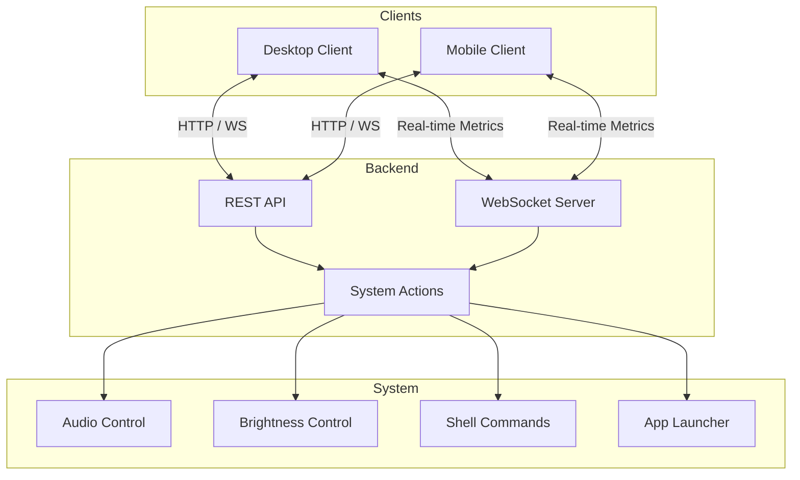

<p align="center">
<a target="_blank" href="https://ahmed-debbiche007.github.io/ctrldeck/">
  
</a>
</p>

<h1 align="center">CtrlDeck</h1>

<p align="center">
  <strong>Press responsibly</strong>
</p>

<p align="center">
  An open-source custom macro deck system
</p>

<p align="center">
  <a href="#features">Features</a> •
  <a href="#architecture">Architecture</a> •
  <a href="#usage">Usage</a> •
  <a href="#contributing">Contributing</a> •
  <a href="#license">License</a>
</p>

---

## Features

### Customizable Buttons
- Create unlimited custom buttons with drag-and-drop reordering
- Custom icons and colors
- Multiple action types: launch apps, run scripts, open URLs, control volume/brightness

### Real-time Widgets
- CPU, RAM, and battery monitoring
- Network speeds and CPU temperature
- Weather and clock widgets

### System Controls
- Volume and microphone control with visual feedback
- Brightness adjustment (knob & slider)

### Cross-Platform Clients
- Desktop client for Linux and Windows
- Mobile client for Android and iOS
- QR code pairing for easy setup

---

## Architecture



---

## Usage

Download the latest release for your platform from the [Releases Page](https://github.com/Ahmed-Debbiche007/streamdeck/releases).

### Desktop
1. Download and run the desktop client
2. The backend server starts automatically
3. Configure your buttons and widgets

### Mobile
1. Download the Android APK from releases
2. Scan the QR code shown in the desktop client
3. Start controlling your system remotely

---

## Contributing

We welcome contributions! Here's how you can help:

### Getting Started

1. Fork the repository
2. Clone your fork:
   ```bash
   git clone https://github.com/YOUR_USERNAME/streamdeck.git
   cd streamdeck
   ```
3. Create a feature branch:
   ```bash
   git checkout -b feature/your-feature-name
   ```


### Making Changes

1. Make your changes in the appropriate directory
2. Test your changes locally
3. Commit with clear, descriptive messages:
   ```bash
   git commit -m "feat: add new button action type"
   ```

### Commit Convention

We use [Conventional Commits](https://www.conventionalcommits.org/):

| Prefix | Description |
|--------|-------------|
| `feat:` | New feature |
| `fix:` | Bug fix |
| `docs:` | Documentation changes |
| `style:` | Code style changes (formatting) |
| `refactor:` | Code refactoring |
| `test:` | Adding or updating tests |
| `chore:` | Maintenance tasks |

### Submitting Changes

1. Push to your fork:
   ```bash
   git push origin feature/your-feature-name
   ```
2. Open a Pull Request against the `main` branch
3. Describe your changes and link any related issues

### Reporting Issues

- Use the [Issues](https://github.com/Ahmed-Debbiche007/streamdeck/issues) page
- Include steps to reproduce, expected behavior, and actual behavior
- Add screenshots if applicable

